# 🚀 CrowdFund Solana - Decentralized Crowdfunding Platform

[](https://opensource.org/licenses/MIT)
[](https://solana.com/)
[](https://nextjs.org/)
[](https://typescriptlang.org/)
[](https://anchor-lang.com/)

A modern, decentralized crowdfunding platform built on Solana blockchain that enables transparent, secure, and efficient project funding with minimal transaction fees.

## 🌟 **Live Demo**

🔗 **Website**: [https://crowdfund.itssvk.dev](https://crowdfund.itssvk.dev)  
📱 **PWA**: Installable as a native app on desktop and mobile  
🐦 **Feedback**: Tag [@ShouvikMohanta](https://twitter.com/ShouvikMohanta) on Twitter

---

## 📋 **Table of Contents**

- [🎯 Overview](#-overview)
- [✨ Features](#-features)
- [🏗️ Architecture](#️-architecture)
- [📊 Campaign Flow](#-campaign-flow)
- [📁 Project Structure](#-project-structure)
- [🛠️ Tech Stack](#️-tech-stack)
- [🚀 Quick Start](#-quick-start)
- [📖 Detailed Setup](#-detailed-setup)
- [🧪 Testing](#-testing)
- [🔧 Development](#-development)
- [📱 PWA Features](#-pwa-features)
- [🤝 Contributing](#-contributing)
- [📄 License](#-license)

---

## 🎯 **Overview**

CrowdFund Solana revolutionizes crowdfunding by leveraging blockchain technology to create a transparent, secure, and efficient platform. Built on Solana's high-performance network, it offers:

- **🔒 Trustless Operations**: Smart contracts ensure funds are handled transparently
- **⚡ Lightning Fast**: Near-instant transactions with minimal fees
- **🌍 Global Access**: No geographical restrictions or traditional banking requirements
- **📱 Modern UX**: Progressive Web App with native-like experience
- **🔍 Full Transparency**: All transactions and campaign states are publicly verifiable

## ✨ **Features**

### **For Creators**

- 🎨 Create compelling campaigns with rich descriptions and media
- 📊 Real-time funding progress tracking
- 💰 Secure fund withdrawal after successful completion
- ⏰ Flexible campaign duration and funding goals
- 🛑 Campaign cancellation option before deadline

### **For Contributors**

- 🔍 Browse and discover innovative projects
- 💸 Contribute with SOL cryptocurrency
- 🔄 Withdraw funds if campaigns fail or get cancelled
- 📈 Track contribution history and campaign progress
- 🏆 Support the next generation of ideas

### **Platform Features**

- 🔐 Wallet integration (Phantom, Solflare, etc.)
- 📱 Progressive Web App (PWA) support
- 🎨 Modern, responsive design
- 🌙 Dark/Light theme support
- 🔄 Real-time state synchronization
- 📊 Campaign analytics and statistics

---

## 🏗️ **Architecture**

The platform consists of two main components working together:

```
┌─────────────────┐    ┌──────────────────┐    ┌─────────────────┐
│                 │    │                  │    │                 │
│   Frontend      │◄──►│  Solana RPC      │◄──►│ Smart Contract  │
│   (Next.js)     │    │   Network        │    │   (Anchor)      │
│                 │    │                  │    │                 │
└─────────────────┘    └──────────────────┘    └─────────────────┘
         │                       │                       │
         ▼                       ▼                       ▼
┌─────────────────┐    ┌──────────────────┐    ┌─────────────────┐
│ • React/Next.js │    │ • HTTP RPC       │    │ • Rust/Anchor   │
│ • TypeScript    │    │ • Connection     │    │ • Program PDAs  │
│ • Tailwind CSS  │    │   Management     │    │ • State Mgmt    │
│ • Wallet Adapt. │    │                  │    │ • Security      │
└─────────────────┘    └──────────────────┘    └─────────────────┘
```

---

## 📊 **Campaign Flow**

The platform implements a sophisticated three-way withdrawal system ensuring fair fund distribution:

<div align="center">
  
</div>

### **Campaign States & Actions**

1. **📝 Campaign Creation**: Owner creates campaign with goal and deadline
2. **💰 Active Fundraising**: Contributors can donate SOL to campaigns
3. **⏰ Deadline Check**: System evaluates campaign status after deadline
4. **🎯 Success Path**: Goal achieved → Owner withdraws all funds
5. **❌ Failure Path**: Goal not met → Contributors withdraw their contributions
6. **🛑 Cancellation Path**: Owner cancels → Contributors withdraw anytime

### **Withdrawal Methods**

- **`withdraw_by_owner()`**: Owner withdraws all funds after successful campaign
- **`withdraw_if_failed()`**: Contributors withdraw after failed campaigns
- **`withdraw_if_cancelled()`**: Contributors withdraw after campaign cancellation

---

## 📁 **Project Structure**

```
crowdfund-dapp/
├── 📂 app/                    # Frontend Application (Next.js)
│   ├── 📂 app/               # Next.js 13+ App Router
│   │   ├── 📄 layout.tsx     # Root layout with providers
│   │   ├── 📄 page.tsx       # Landing page
│   │   └── 📂 app/           # Main application pages
│   ├── 📂 components/        # Reusable React components
│   │   ├── 📂 ui/           # shadcn/ui components
│   │   ├── 📂 pages/        # Page-specific components
│   │   ├── 📄 logo.tsx      # Brand logo component
│   │   └── 📄 pwa-installer.tsx # PWA installation
│   ├── 📂 lib/              # Utility libraries
│   │   ├── 📄 utils.ts      # Common utilities
│   │   └── 📄 solana.ts     # Solana connection setup
│   ├── 📂 hooks/            # Custom React hooks
│   ├── 📂 contexts/         # React Context providers
│   ├── 📂 types/            # TypeScript type definitions
│   ├── 📂 provider/         # Wallet and theme providers
│   ├── 📂 idl/              # Anchor IDL files
│   └── 📂 public/           # Static assets & PWA files
│
├── 📂 crowdfund/             # Smart Contract (Anchor)
│   ├── 📂 programs/         # Anchor programs
│   │   └── 📂 crowdfund/    # Main crowdfunding program
│   │       └── 📄 lib.rs    # Smart contract logic
│   ├── 📂 tests/            # Anchor test suite
│   │   └── 📄 crowdfund.ts  # Comprehensive tests
│   ├── 📂 target/           # Build artifacts
│   ├── 📄 Anchor.toml       # Anchor configuration
│   └── 📄 Cargo.toml        # Rust dependencies
│
├── 📄 README.md             # This comprehensive guide
└── 📄 diagram.svg           # Campaign flow visualization
```

## 🛠️ **Tech Stack**

### **Frontend (`/app`)**

- **Framework**: Next.js 14 with App Router
- **Language**: TypeScript
- **Styling**: Tailwind CSS + shadcn/ui
- **State Management**: React Context + Custom Hooks
- **Solana Integration**: `@solana/wallet-adapter-*`
- **PWA**: Service Worker + Web Manifest
- **Build Tool**: Bun (faster than npm/yarn)

### **Smart Contract (`/crowdfund`)**

- **Framework**: Anchor (Solana's developer framework)
- **Language**: Rust
- **Testing**: Anchor's built-in test suite
- **Deployment**: Solana CLI + Anchor CLI

### **Infrastructure**

- **Blockchain**: Solana (Devnet/Mainnet)
- **RPC**: Multiple providers for reliability
- **Hosting**: Vercel (Frontend) + Solana Network (Smart Contract)

---

## 🚀 **Quick Start**

### **Prerequisites**

- [Node.js](https://nodejs.org/) (v18+)
- [Bun](https://bun.sh/) (recommended) or npm/yarn
- [Rust](https://rustup.rs/) (for smart contract development)
- [Solana CLI](https://docs.solana.com/cli/install-solana-cli-tools)
- [Anchor CLI](https://anchor-lang.com/docs/installation)
- [Phantom Wallet](https://phantom.app/) or compatible Solana wallet

### **🔥 One-Command Setup**

```bash
git clone https://github.com/your-username/crowdfund-dapp.git
cd crowdfund-dapp
```

## 📖 **Detailed Setup**

### **1. 🖥️ Frontend Setup (`/app`)**

```bash
cd app
bun install                    # Install dependencies
bun run dev                    # Start development server
```

**Available Scripts:**

```bash
bun run dev                    # Development server (localhost:3000)
bun run build                  # Production build
bun run start                  # Production server
bun run lint                   # ESLint checking
```

### **2. ⚓ Smart Contract Setup (`/crowdfund`)**

```bash
cd crowdfund
anchor build                   # Build the program
anchor test                    # Run test suite
anchor deploy                  # Deploy to configured network
```

**Anchor Commands:**

```bash
anchor build                   # Compile Rust program
anchor test                    # Run all tests
anchor deploy --provider.cluster devnet  # Deploy to devnet
anchor localnet                # Start local test validator
```

### **3. 🔧 Environment Configuration**

**Frontend (`.env.local`):**

```env
NEXT_PUBLIC_RPC_ENDPOINT=https://api.devnet.solana.com
```

**Smart Contract (`Anchor.toml`):**

```toml
[toolchain]
package_manager = "yarn"

[features]
resolution = true
skip-lint = false

[programs.devnet]
crowdfund = "CyAAhAthb87MH3MQzcj8gAWTTaTkQ6cqboTYauMjuxch"

[registry]
url = "https://api.apr.dev"

[scripts]
test = "yarn run ts-mocha -p ./tsconfig.json -t 1000000 tests/**/*.ts"
```

---

## 🧪 **Testing**

### **Smart Contract Tests**

Our test suite covers all critical scenarios:

```bash
cd crowdfund
anchor test                    # Run all 8 test cases
```

**Test Coverage:**

- ✅ Campaign creation and initialization
- ✅ Contribution handling and validation
- ✅ Successful campaign completion
- ✅ Failed campaign refunds
- ✅ Campaign cancellation
- ✅ Owner withdrawal after success
- ✅ Contributor withdrawal after failure/cancellation
- ✅ Edge cases and error handling

### **Frontend Testing**

```bash
cd app
bun run test                   # Run Jest tests
bun run test:watch            # Watch mode
bun run test:coverage         # Coverage report
```

---

## 🔧 **Development**

### **🔄 Development Workflow**

1. **Local Development**:

   ```bash
   # Terminal 1: Start local Solana validator
   solana-test-validator

   # Terminal 2: Deploy smart contract
   cd crowdfund && anchor deploy --provider.cluster localnet

   # Terminal 3: Start frontend
   cd app && bun run dev
   ```

2. **Testing Changes**:

   ```bash
   # Test smart contract
   cd crowdfund && anchor test

   # Test frontend
   cd app && bun run test
   ```

3. **Building for Production**:

   ```bash
   # Build smart contract
   cd crowdfund && anchor build

   # Build frontend
   cd app && bun run build
   ```

### **🔗 Network Configuration**

**Devnet (Development)**:

- Network: `https://api.devnet.solana.com`
- Airdrop: `solana airdrop 2` (free SOL for testing)
- Explorer: `https://explorer.solana.com/?cluster=devnet`

**Mainnet (Production)**:

- Network: `https://api.mainnet-beta.solana.com`
- Real SOL required for transactions
- Explorer: `https://explorer.solana.com/`

---

## 📱 **PWA Features**

The frontend is a full Progressive Web App with:

- **📲 Installable**: Add to home screen on mobile/desktop
- **⚡ Offline Support**: Service worker caching
- **🔔 Push Notifications**: Infrastructure ready
- **📱 Native Feel**: No browser chrome when installed
- **🎨 Custom Icons**: Beautiful app icons for all devices

**Installation:**

- **Desktop**: Click install button in address bar
- **Mobile**: "Add to Home Screen" option
- **Automatic**: Install prompt appears when criteria met

---

## 🤝 **Contributing**

We welcome contributions! This project will be open-source in the future.

### **Current Development Status**

- ✅ **MVP Complete**: Core functionality working
- ✅ **Smart Contract**: Three-way withdrawal system
- ✅ **Frontend**: Modern React app with PWA
- ✅ **Testing**: Comprehensive test coverage
- 🚧 **In Progress**: Additional features and optimizations
- 🔜 **Coming Soon**: Mainnet deployment

### **Development Areas**

- 🎨 **Frontend**: React, TypeScript, UI/UX improvements
- ⚓ **Smart Contract**: Rust, Anchor, security audits
- 🧪 **Testing**: Test coverage expansion
- 📚 **Documentation**: Technical documentation
- 🔒 **Security**: Code reviews and audits

---

## 📞 **Support & Feedback**

- 🐛 **Bug Reports**: Open GitHub issues
- 💡 **Feature Requests**: GitHub discussions
- 🐦 **General Feedback**: [@ShouvikMohanta](https://twitter.com/ShouvikMohanta)
- 📧 **Security Issues**: Direct message on Twitter

---

## 🗺️ **Roadmap**

### **Phase 1: Foundation** ✅

- ✅ Smart contract development
- ✅ Frontend application
- ✅ PWA implementation
- ✅ Testing infrastructure

### **Phase 2: Enhancement** 🚧

- 🚧 Advanced analytics
- 🚧 Social features
- 🚧 Campaign categories
- 🚧 Mobile optimizations

### **Phase 3: Production** 🔜

- 🔜 Security audit
- 🔜 Mainnet deployment
- 🔜 Open-source release
- 🔜 Community features

---

## 📄 **License**

This project is licensed under the MIT License - see the [LICENSE](LICENSE) file for details.

---

## 🙏 **Acknowledgments**

- **Solana Foundation** for the amazing blockchain platform
- **Anchor Framework** for simplifying Solana development
- **shadcn/ui** for beautiful React components
- **Vercel** for seamless deployment
- **The Solana Community** for continuous support and feedback

---

<div align="center">

**Built with ❤️ on Solana**

[🌐 Website](https://crowdfund.itssvk.dev) • [🐦 Twitter](https://twitter.com/ShouvikMohanta) • [📊 Explorer](https://explorer.solana.com/)

</div>
